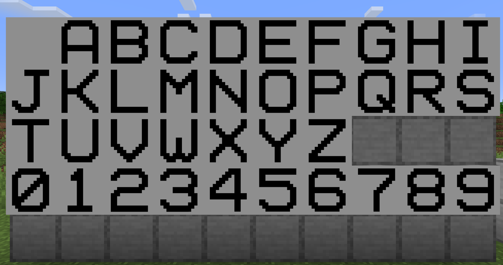
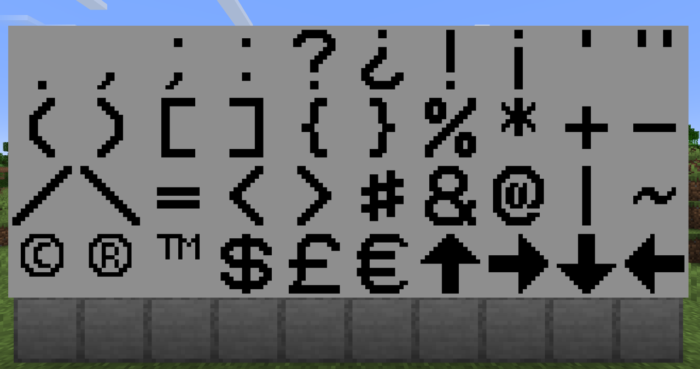
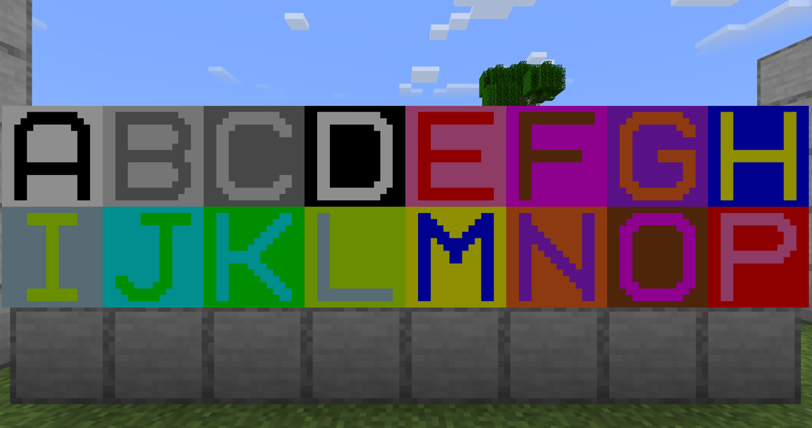
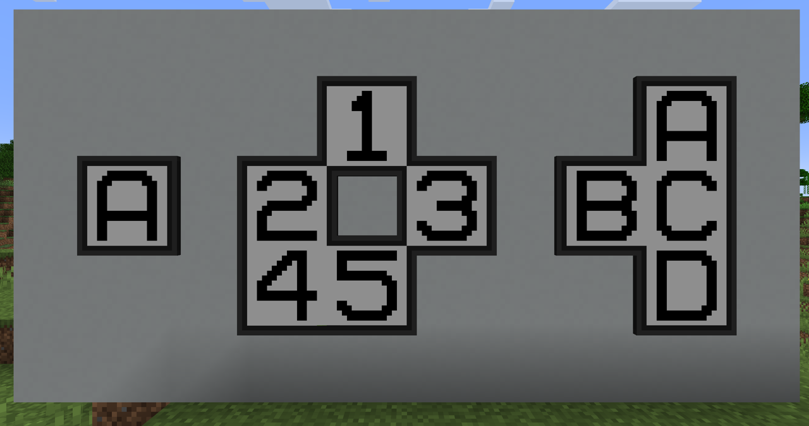
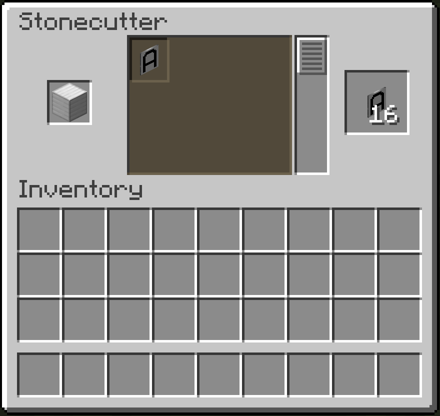
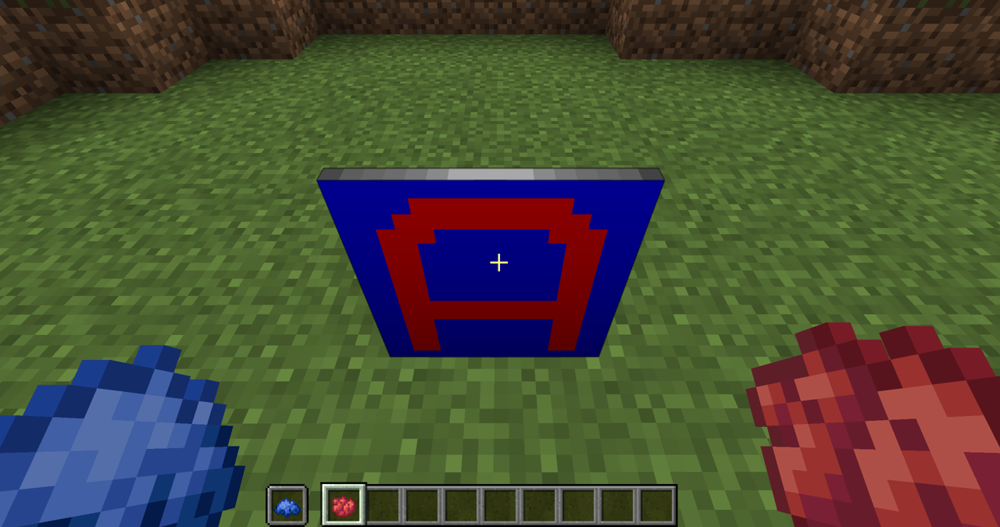

# Large Iron Sign

This is a mod for Minecraft that adds a sign that displays a single large character. The character can be any capital letter, numeric digit, or one of 40 other symbols.

The sign can be coloured, both the text and the background separately.

An optional trim can be added to the sign.

## Dependencies

| Minecraft | Java | Fabric Loader | Fabric API     |
|-----------|------|---------------|----------------|
| 1.20.1    | 17   | 0.16.5        | 0.92.2+1.20.1  |
| 1.20.2    | 17   | 0.16.5        | 0.91.6+1.20.2  |
| 1.20.3    | 17   | 0.16.5        | 0.91.1+1.20.3  |
| 1.20.4    | 17   | 0.16.5        | 0.97.2+1.20.4  |
| 1.20.6    | 21   | 0.16.5        | 0.100.8+1.20.6 |
| 1.21.1    | 21   | 0.16.5        | 0.105.0+1.21.1 |

## How to Use

To make signs, use an iron block in a stonecutter. This will produce 16 signs.

Place the sign, then right-click it and select the character it should display. You can also enable/disable the trim here.

To change the text colour, hold a dye in your main hand and right-click the sign.

To change the background colour, hold a dye in your off hand and right-click the sign.

If you have a dye in both hands, you can set both the text and background colour at the same time.

## Credits

Textures based on font: https://www.dafont.com/vcr-osd-mono.font
